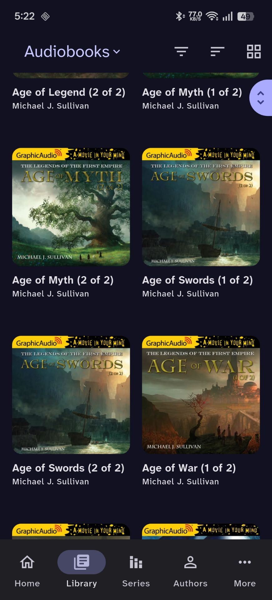
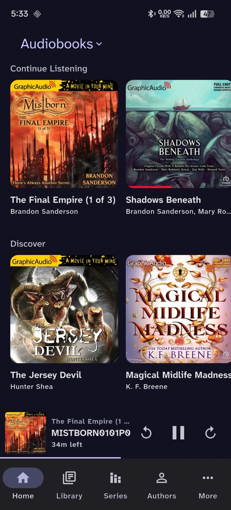
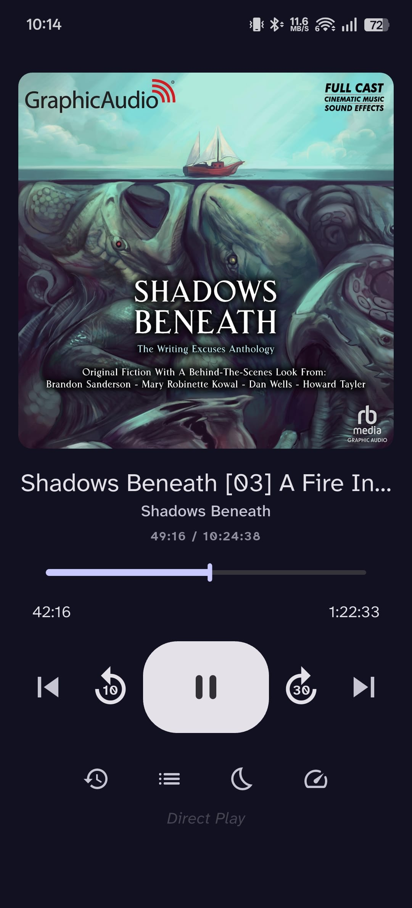
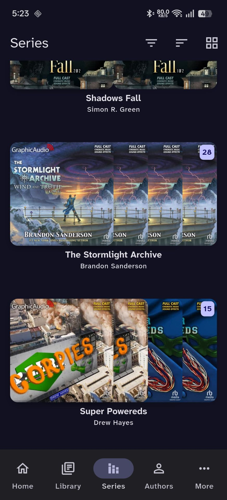
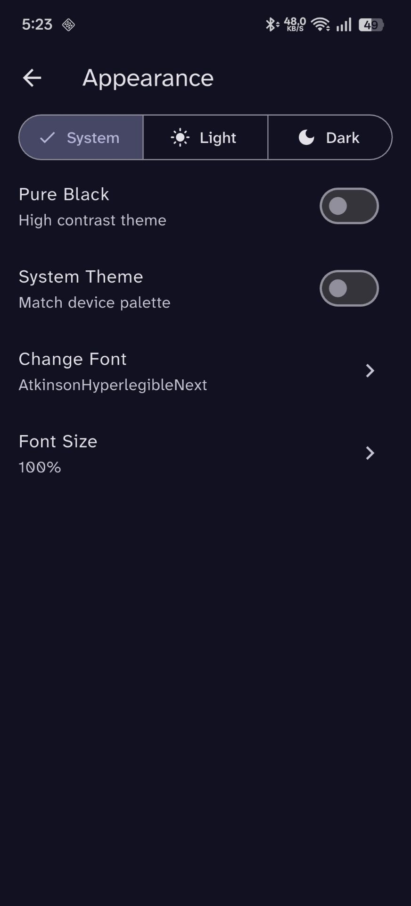

# Storii

A flutter client for [audiobookshelf](https://github.com/advplyr/audiobookshelf) focused on simple UX, and maintainable architecture.

## Features

- Audiobook streaming with background playback and progress sync
- Multi-user, multi-server and OIDC support with persistent sessions
- Advanced library browsing with filters, sorting, and series grouping
- Supports downloads and offline sessions
- Responsive UI with reusable components across feature modules

## Demo

[Watch demo](https://youtube.com/shorts/ngYgcCmK-cE)

## Screenshots

| Library | Server |
|:--------|:-------|
|  |  |

| Home with Player | Now Playing |
|:-----------------|:------------|
|  |  |

| Book Details | Series |
|:-------------|:-------|
|  |  |

| Settings | Appearance |
|:---------|:-----------|
|  |  |

## Roadmap

- Offline downloads for audiobooks  
- Podcast support  

## Tech Stack & Architecture

- Flutter (Dart) with feature-based modular architecture

- Riverpod for scalable state management

- Dio-based API layer with interceptors and endpoint abstraction

- Background audio handling with persistent playback state

- Local storage using Hive and secure storage for authentication

## Contributing

Contributions are welcome. Please read [CONTRIBUTING.md](CONTRIBUTING.md) before submitting a PR.

## Acknowledgements

Adapted and extended from the original [audiobookshelf_api](https://github.com/audiobookshelf-flutter/audiobookshelf_api), which provided the initial API structure.
Extended by migrating from http to Dio, adding interceptors and improved error handling.
Full credit to the original contributors for the foundation.

## License

Storii is licensed under the [GNU General Public License v3.0](LICENSE.txt).

    Storii
    Copyright (C) 2026 Likhith Praveen K

    This program is free software: you can redistribute it and/or modify
    it under the terms of the GNU General Public License as published by
    the Free Software Foundation, either version 3 of the License, or
    (at your option) any later version.

    This program is distributed in the hope that it will be useful,
    but WITHOUT ANY WARRANTY; without even the implied warranty of
    MERCHANTABILITY or FITNESS FOR A PARTICULAR PURPOSE.  See the
    GNU General Public License for more details.

    You should have received a copy of the GNU General Public License
    along with this program.  If not, see <https://www.gnu.org/licenses/>.
