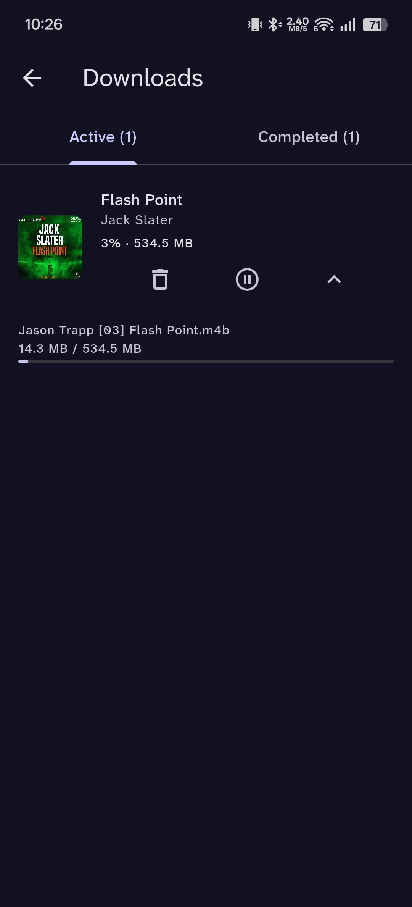

# Storii

A flutter client for [audiobookshelf](https://github.com/advplyr/audiobookshelf) focused on simple UX, and maintainable architecture.

## Features

- Audiobook streaming with background playback and progress sync
- **Offline downloads** - fully functional download manager with pause/resume and local playback
- Multi-user, multi-server and OIDC support with persistent sessions
- Personalized home shelves: continue listening, recent series, newest authors, etc.
- Advanced library browsing with filters, sorting, and series grouping
- Search across books, series, authors, narrators, tags, and genres
- Customizable player: sleep timer, speed control, seek buttons, chapter navigation, and listening history
- Appearance settings: system/light/dark themes, dynamic colors, pure black mode, custom fonts, font scaling
- Navigation customization: reorder tabs, choose startup screen, label behavior

> **Note:** Podcast support is not yet available.

## Demo

[Watch demo](https://youtube.com/shorts/ngYgcCmK-cE)

## Screenshots

| Library | Downloads |
|:--------|:-------|
|  |  |

| Home with Player | Now Playing |
|:-----------------|:------------|
|  |  |

| Book Details | Series |
|:-------------|:-------|
|  |  |

| Settings | Appearance |
|:---------|:-----------|
|  |  |

## Roadmap

- User stats
- Additional player enhancements (bookmarks, equalizer)
- Collections / playlists support
- Complete podcast playback and episode management

## Tech Stack

| Layer           | Technologies |
|-----------------|--------------|
| **State**       | Riverpod |
| **Networking**  | Dio (REST), Socket.IO (real‑time) |
| **Audio**       | just_audio, audio_service, audio_session |
| **Local Data**  | Hive CE, Flutter Secure Storage |
| **Routing**     | GoRouter |
| **Code Gen**    | Freezed, json_serializable, riverpod_generator, build_runner |

## Contributing

Contributions are welcome. Please read [CONTRIBUTING.md](CONTRIBUTING.md) before submitting a PR.

## License

Storii is licensed under the [GNU General Public License v3.0](LICENSE.txt).

    Storii
    Copyright (C) 2026 Likhith Praveen K

    This program is free software: you can redistribute it and/or modify
    it under the terms of the GNU General Public License as published by
    the Free Software Foundation, either version 3 of the License, or
    (at your option) any later version.

    This program is distributed in the hope that it will be useful,
    but WITHOUT ANY WARRANTY; without even the implied warranty of
    MERCHANTABILITY or FITNESS FOR A PARTICULAR PURPOSE.  See the
    GNU General Public License for more details.

    You should have received a copy of the GNU General Public License
    along with this program.  If not, see <https://www.gnu.org/licenses/>.
