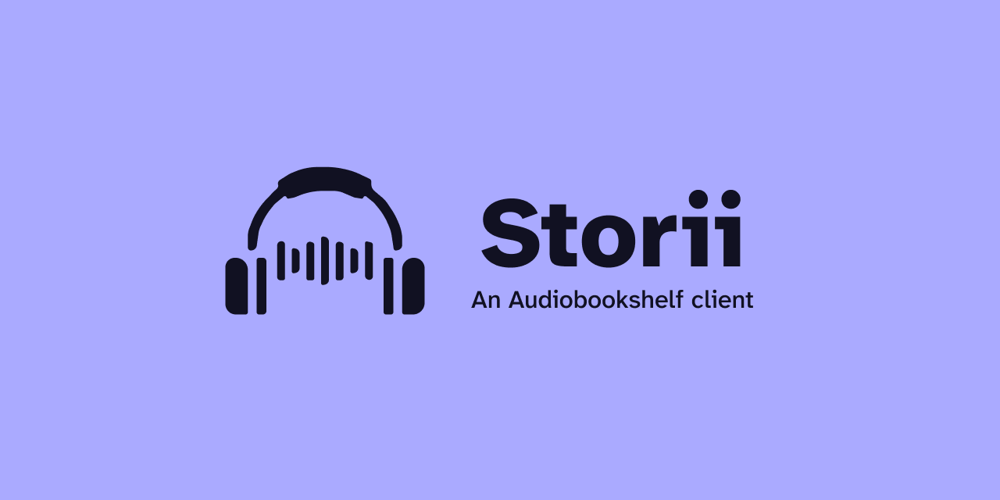
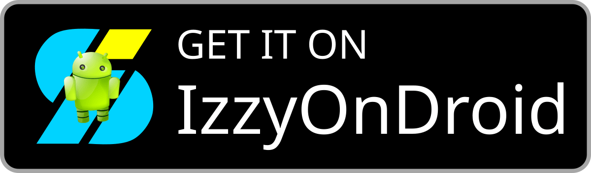
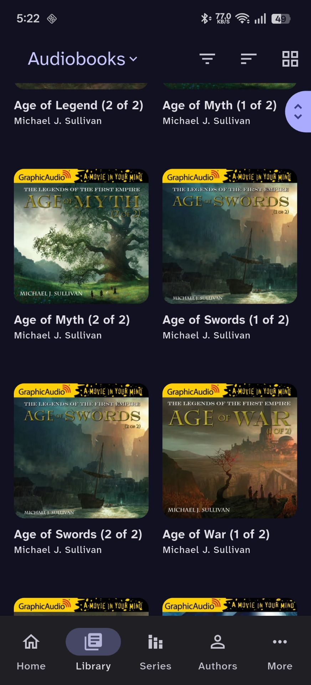
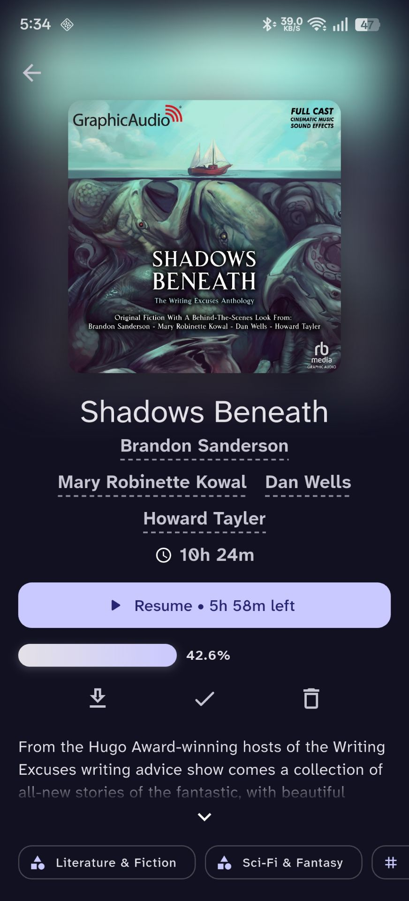
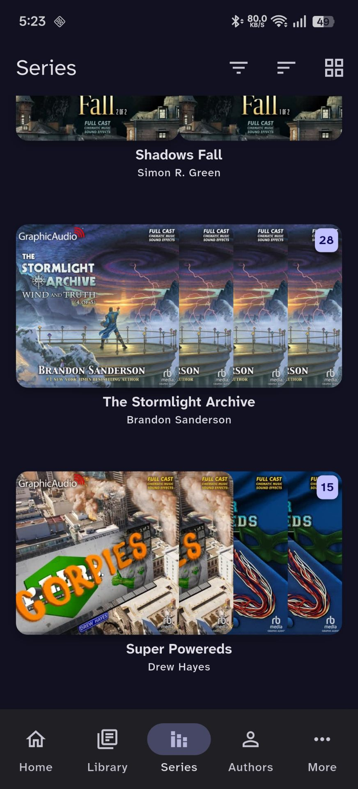
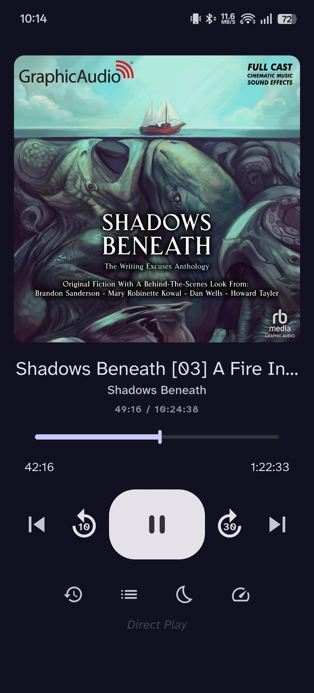
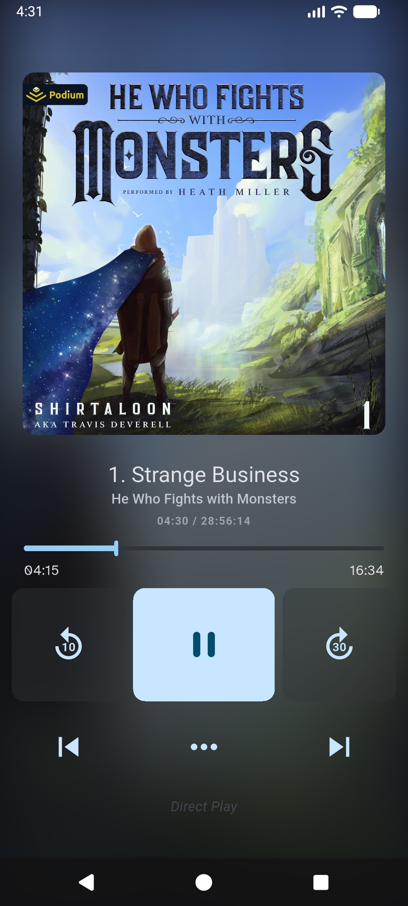
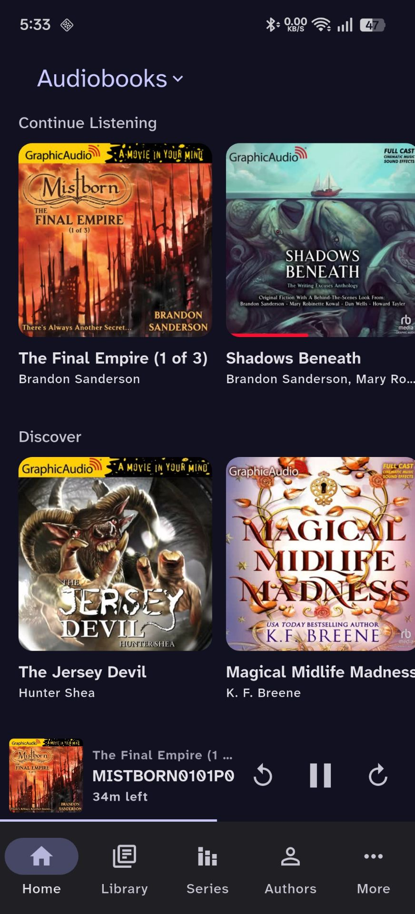
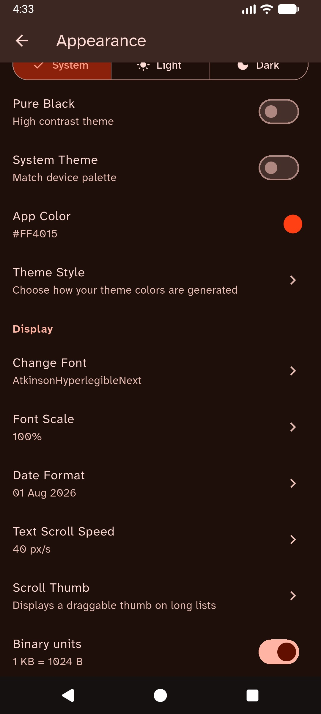
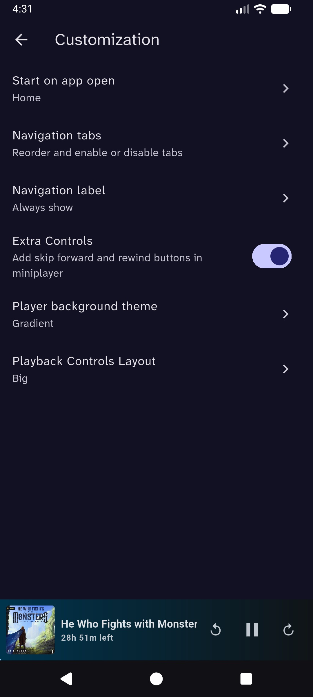

<br />
<div align="center">
   
</div>
<br />

# Storii

A Flutter client for <a href="https://github.com/advplyr/audiobookshelf">Audiobookshelf</a> focused on simple UX and maintainable architecture


[](https://shields.rbtlog.dev/com.likhithpraveenk.storii)

[![IzzyOnDroid Yearly Downloads](https://img.shields.io/badge/dynamic/json?url=https://dlstats.izzyondroid.org/iod-stats-collector/stats/basic/yearly/rolling.json&query=$.['com.likhithpraveenk.storii']&label=IzzyOnDroid%20Downloads&logo=)](https://apt.izzysoft.de/packages/com.likhithpraveenk.storii)
[](https://hosted.weblate.org/engage/storii/)

### Download & Release Info


[![IzzyOnDroid Version](https://img.shields.io/f-droid/v/com.likhithpraveenk.storii?baseUrl=https://apt.izzysoft.de/fdroid&label=IzzyOnDroid&color=blue&style=for-the-badge&logo=)](https://apt.izzysoft.de/fdroid/index/apk/com.likhithpraveenk.storii)
[](https://github.com/likhithpraveenk/storii/releases)
[](https://www.gnu.org/licenses/gpl-3.0)

[](https://f-droid.org/packages/com.likhithpraveenk.storii)
[](https://apt.izzysoft.de/packages/com.likhithpraveenk.storii)
[](https://github.com/likhithpraveenk/storii/releases/latest)
[](https://apps.obtainium.imranr.dev/redirect.html?r=obtainium://add/https://github.com/likhithpraveenk/storii)

>  **Disclaimer:** This is an unofficial Audiobookshelf client. It is neither affiliated with nor endorsed by the Audiobookshelf project or its maintainers.

## Features

- Audiobooks & Podcasts streaming with background playback and progress sync
- Offline downloads - fully functional download manager with pause/resume, search, and sort
- Multi-user, multi-server and OIDC support with persistent sessions
- Personalized home shelves: continue listening, recent series, newest authors, etc.
- Advanced library browsing with filters, sorting, and series grouping
- Search across books, series, authors, narrators, tags, and genres
- Customizable player: sleep timer, speed control, seek buttons, chapter navigation, listening history, bookmarks, OS notification controls, and configurable skip-back after interruptions
- Playback queue: supporting collections & playlists
- Appearance settings: system/light/dark themes, dynamic colors, pure black mode, custom fonts, font scaling
- Navigation customization: reorder tabs, choose startup screen, label behavior
- Server admin tools (admin users): trigger library scans, re-scan/re-match items

## Demo

[Watch demo](https://youtube.com/shorts/ngYgcCmK-cE)

## Screenshots

|                                                                                                                         |                                                                                                                          |                                                                                                                      |                                                                                                                              |
| :---------------------------------------------------------------------------------------------------------------------: | :----------------------------------------------------------------------------------------------------------------------: | :------------------------------------------------------------------------------------------------------------------: | :--------------------------------------------------------------------------------------------------------------------------: |
|       |  |  |  |
|  |           |                |                     |

## Feature Comparison

| Feature                               | Storii | Official ABS app |
| ------------------------------------- | :----: | :--------------: |
| Audiobook & Podcast streaming         |   ✅   |        ✅        |
| Offline downloads                     |   ✅   |        ✅        |
| Sleep timer                           |   ✅   |        ✅        |
| Playback speed control                |   ✅   |        ✅        |
| Chapter navigation                    |   ✅   |        ✅        |
| Bookmarks                             |   ✅   |        ✅        |
| Multi-server support                  |   ✅   |        ✅        |
| Multi-user / OIDC                     |   ✅   |        ✅        |
| Library browsing (filter/sort/series) |   ✅   |        ✅        |
| Listening history                     |   ✅   |        ✅        |
| Custom themes & fonts                 |   ✅   |        ❌        |
| Dynamic colors (Material You)         |   ✅   |        ❌        |
| Navigation customization              |   ✅   |        ❌        |
| Collections / Playlists               |   ✅   |        ✅        |
| Equalizer                             |   💡   |        ❓        |
| Server management / admin             |   ⚠️   |        ❌        |
| eBook reader                          |   💡   |        ✅        |
| Chromecast                            |   💡   |        ✅        |
| Android Auto                          |   💡   |        ✅        |
| iOS support [^1]                      |   ⚠️   |        ✅        |
| Desktop apps                          |   💡   |        ❌        |

> ✅ Supported &nbsp; ❌ **Not** supported &nbsp; 🔜 Planned &nbsp; 💡 On Request &nbsp; ⚠️ Partial

[^1]: An IPA can be provided for sideloading. App Store version not planned

## Tech Stack

| Layer          | Technologies                                                 |
| -------------- | ------------------------------------------------------------ |
| **State**      | Riverpod                                                     |
| **Networking** | Dio (REST), Socket.IO (real‑time)                            |
| **Audio**      | just_audio, audio_service, audio_session                     |
| **Local Data** | Hive CE, Flutter Secure Storage                              |
| **Routing**    | GoRouter                                                     |
| **Code Gen**   | Freezed, json_serializable, riverpod_generator, build_runner |

## Acknowledgments

- **[Audiobookshelf](https://github.com/advplyr/audiobookshelf)**: The open-source, self-hosted audiobook and podcast server this app is built for
- **[Finamp](https://github.com/unicornsonlsd/finamp)**: Inspiration for settings architecture
- **[yaabsa](https://github.com/Vito0912/yaabsa)**: Bootstrapped the initial app structure

## Contributing

Contributions are welcome. Please read [CONTRIBUTING.md](CONTRIBUTING.md) before submitting a PR.

## Translations

Do you wish to use the app in your language? Help translate on [Weblate/Storii](https://hosted.weblate.org/engage/storii/).

[](https://hosted.weblate.org/engage/storii/)

Thanks to [Weblate](https://weblate.org/) for making this project's translations possible through their free, libre hosting.

## License

[](LICENSE.txt)

```txt
Storii - an Audiobookshelf client
Copyright (C) 2026 Likhith Praveen K

This program is free software: you can redistribute it and/or modify
it under the terms of the GNU General Public License as published by
the Free Software Foundation, either version 3 of the License, or
any later version.
```
